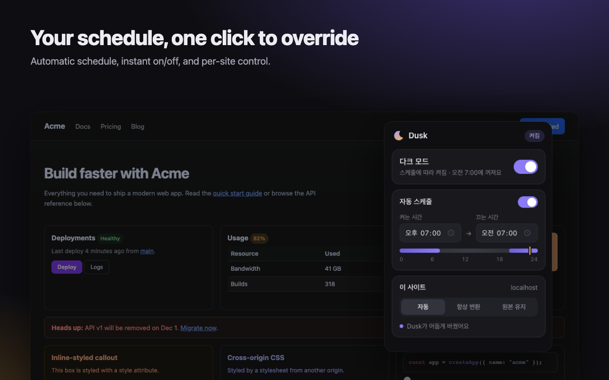

# Dusk

**Dark mode, on your schedule.**

A Chrome extension that turns every tab dark at night, choosing the most natural approach for each page:

1. **The site's own dark theme** — if a site ships a dark theme, Dusk switches it on, logos included.
2. **Already-dark sites** — pages that are already dark are left exactly as they are.
3. **Everything else is converted** — every color is recomputed by its role: backgrounds go dark, text goes light, and buttons and brand colors keep their hue at a readable brightness. Photos are left alone, and black logos on transparent backgrounds are made visible.



## Features

- **Schedule** — pick when dark mode turns on and off (default 7 PM – 7 AM).
- **Instant override** — flip the switch to turn it on or off now; the schedule takes over again at the next change.
- **Per-site modes** — Auto, Always convert, or Keep original.
- **No white flash** — pages are painted dark from the first frame while dark mode is active.
- **Smooth transitions** — switching on or off cross-fades the page.
- **Private** — no data collection, analytics, or remote code. See [PRIVACY.md](PRIVACY.md).

## Build and install locally

Use Node.js 22.18 or newer and npm. Chrome 123 or newer is required by the extension manifest.

```sh
npm ci
npm run build
```

1. Open `chrome://extensions`.
2. Enable **Developer mode**.
3. Select **Load unpacked** and choose this repository's `dist/` directory.
4. Open Dusk from the extensions menu to set the schedule or choose a per-site mode.

The extension uses Manifest V3, a background service worker, content scripts, and a popup. Page access is required to inspect and transform site colors; settings are stored with Chrome's storage API. See [PRIVACY.md](PRIVACY.md) for details.

## Development

```sh
npm run watch      # Rebuild as source files change
npm run typecheck  # Check TypeScript types
npm test           # Run unit tests
npm run e2e        # Build and run browser checks
npm run zip        # Build and package the extension
```

Reload the unpacked extension after rebuilding. The browser checks use Playwright and require its Chromium browser installation.

## Code map

| Path | Purpose |
| --- | --- |
| `src/background.ts` | Scheduling and background coordination |
| `src/content/` | Theme detection and page color conversion |
| `src/main-world.ts` | Page-context integration |
| `src/popup/` | Schedule and site settings UI |
| `src/shared/` | Settings, messages, and image analysis |
| `test/` | Unit and browser checks |
| `scripts/` | Build and packaging tools |
